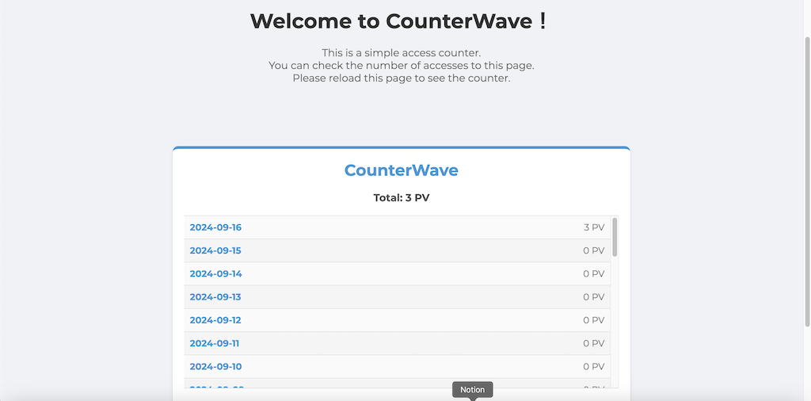

# CounterWave: Simple Access Counter

**CounterWave** is a simple access counter that developed by PHP and JavaScript.

Displays PV for the entire period and the past 30 days.

## Features

The main features are as follows.

- Count the number of visitor accesses.
- You can display PV for the entire period and the past 30 days.
- You can specify the IP address you want to exclude.

To actually use it, you must place the necessary files on the server running PHP.

## Screenshot



## How to use

1. Save `counterwave.php` / `counterwave.js` / `counterwave.css` in a suitable location.
2. Add the following HTML to the location of the HTML page where you want to display the access counter.

```html
<div class="counterwave">
  <p>CounterWave</p>
  <p id="totalViews">Total:</p>
  <ul id="dailyViews"></ul>
  <p id="startDate">Start Date:</p>
</div>
```

3. Load CSS and JS.

Load `counterwave.js` just before the `/body` tag.

```html
<link rel="stylesheet" href="css/counterwave.css">
```

```html
<script type="text/javascript" src="js/counterwave.js"></script>
```

4. Edit your IP address in the excluded IP address list at the top of `counterwave.php` and save.

```php
// List of IP addresses to exclude from the count
$exclude_ips = array(
  '1.2.3.4',
);
```

## License

Distributed under the MIT License.

## Author

- Name: Shingo Suzuki
- Mail: suzushinlab@gmail.com
- Twitter: https://twitter.com/suzushin7
- GitHub: https://github.com/suzushin7
